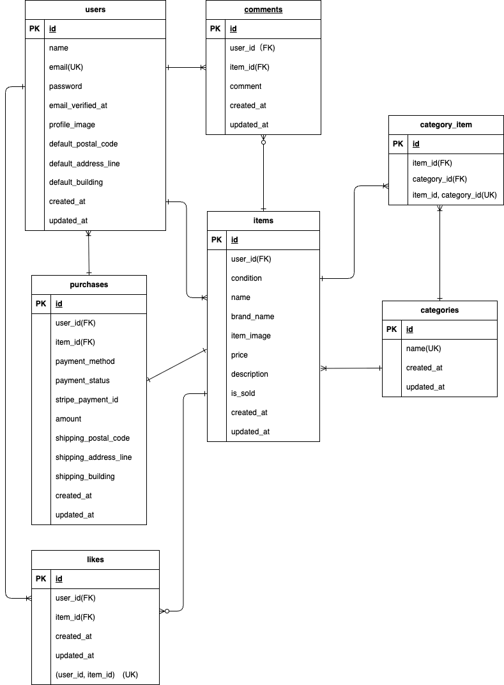

# coachtechフリマ

## 目次
1. [環境構築](#環境構築)
2. [Fortify設定](#fortoify設定)
3. [Stripe設定](#stripe設定)
4. [MailHog設定](#mailhog設定)
5. [PHPUnitテスト](#phpunitテスト)

## 環境構築
**Dockerビルド**\
1.`git clone git@github.com:shino-ym/market-app.git`\
2.DockerDesktopアプリを立ち上げる\
3.`docker-compose up -d --build`

**Laravel環境構築**\
1. PHPコンテナ内に入る\
`docker-compose exec php bash`
2. 依存パッケージをインストール\
`composer install`
3. .env.exampleをコピーして.envを作る\
`cp .env.example .env`
4. vscode「.env」に以下の環境変数を追加
```
DB_CONNECTION=mysql
DB_HOST=mysql
DB_PORT=3306
DB_DATABASE=laravel_db
DB_USERNAME=laravel_user
DB_PASSWORD=laravel_pass
```
5. アプリケーションキーの作成\
`php artisan key:generate`
6. マイグレーションの実行\
`php artisan migrate`
7. ストレージリンクの作成\
`php artisan storage:link`
8. シーディングの実行\
`php artisan db:seed`

>アクセスした場合に権限エラーが発生した場合はコマンドライン上で以下を実行\
`sudo chmod -R 777 src/*`


## Fortify設定
1. PHPコンテナ内に入る\
`docker-compose exec php bash`
2. Fortifyのインストール\
`composer require laravel/fortify`

`php artisan vendor:publish --provider="Laravel\Fortify\FortifyServiceProvider"`

3. マイグレーション実行\
`php artisan migrate`
4. Fortify設定

#### 詳細は折りたたみで表示

<details> <summary>FortifyServiceProvider・app.php・日本語化の設定</summary>

app.php

```diff
- 'locale' => 'en',
+ 'locale' => 'ja',
```

```
'providers' => [
    App\Providers\RouteServiceProvider::class,
+   App\Providers\FortifyServiceProvider::class,
],
```

FortifyServiceProvider.php（抜粋）
```
public function boot()
{
    Fortify::createUsersUsing(CreateNewUser::class);
    Fortify::registerView(fn() => view('auth.register'));
    Fortify::loginView(fn() => view('auth.login'));

    RateLimiter::for('login', function (Request $request) {
        $email = (string) $request->email;
        return Limit::perMinute(10)->by($email.$request->ip());
    });
}
```

#### RouteServiceProvider.php
```diff
- public const HOME = '/dashboard';
+ public const HOME = '/';
```

#### 日本語化(PHPコンテナ内で実行)

`composer require laravel-lang/lang:~7.0 --dev`\
`cp -r ./vendor/laravel-lang/lang/src/ja ./resources/lang/`

</details>

## Stripe設定
<details><summary>クリックで展開</summary>

PHPコンテナ内にてインストール

`composer require stripe/stripe-php`

#### .envに記入
```
STRIPE_KEY=pk_test_*****************************
STRIPE_SECRET=sk_test_*****************************
```
>.env には Stripe のテスト用キーを設定してください。
（必要に応じて Stripe 公式サイトから取得してください）

#### config/services.php
```
'stripe' => [
    'secret' => env('STRIPE_SECRET',''),
    'public' => env('STRIPE_PUBLIC',''),
],
```

#### コントローラ利用例
```
use Stripe\StripeClient;
$stripe = new StripeClient(config('services.stripe.secret'));
```
#### テストカード

`4242 4242 4242 4242（任意のCVC・期限）`

</details>

## MailHog設定
<details> <summary>クリックで展開</summary>

1. envに以下を修正
```
MAIL_MAILER=smtp
MAIL_HOST=mailhog
MAIL_PORT=1025
MAIL_USERNAME=null
MAIL_PASSWORD=null
MAIL_ENCRYPTION=null
MAIL_FROM_ADDRESS=test@test.com
MAIL_FROM_NAME="${APP_NAME}"
```

2. docker-compose.ymlに以下を追加
```
  mailhog:
    image: mailhog/mailhog:latest
    ports:
      - "1025:1025"
      - "8025:8025"
```
</details>

### ユーザー情報
今回は３つのテストユーザーを作成し、そのユーザー３人が商品を出品したことにしている(コーチの許可あり)\

- テストユーザー1: email(user1@a.com),password(12345678)
- テストユーザー2: email(user2@a.com),password(12345678)
- テストユーザー3: email(user3@a.com),password(12345678)


## PHPUnitテスト
<details> <summary>クリックで展開</summary>

1. テスト用データベース作成\

  コマンドラインにて以下を実行

  `docker exec -it docker market-app-mysql-1 bash`

  `mysql -u root -p`

  passwordの文字が出たら

  `root`

2. テスト用のデータベース(demo_test)を作成するために以下を実行

  `CREATE DATABASE demo_test;`

3. データベースが作成されたか確認

  `SHOW DATABASES;`

4. exitにてMySQLコンテナから退出

5. vscodeの「.env.testing」ファイルのAPP_ENVとAPP_KEYを以下に変更
   ```
    APP_ENV=test
    APP_KEY=
   ```
6. 「.env.testing」ファイルのDBを以下に変更
    ```
    DB_CONNECTION=mysql_test
    DB_HOST=mysql
    DB_PORT=3306
    DB_DATABASE=demo_test
    DB_USERNAME=root
    DB_PASSWORD=root
    ```
7. アプリケーションキーを作成
　`php artisan key:generate --env=testing`

8. キャッシュ削除
  `php artisan config:clear`

9. マイグレーション実行
  `php artisan migrate --env=testing`

10. 全てのテスト項目を一気にテストするために、以下を実行
  `php artisan test`

</details>

## URL
- 開発環境：http://localhost/
- phpMyAdmin:：http://localhost:8080/

## 変更仕様（以下全てコーチの許可あり）
- 購入されたものは、商品一覧画面で赤色でsoldと書かれている。
- 購入済の商品は購入画面に遷移することはできるが、購入するボタンをsoldにして再購入ができない仕様にしている。
- 出品画面で、「出品する」を押すとマイページの出品した商品タグページに遷移。
- 商品の出品者をユーザー3人に割り振って出品している。
- PHPUnitにて、メール認証機能を使用しているため、会員登録後はプロフィール画面への遷移ではなくメール認証画面へ遷移に変更。

## 使用技術
- PHP 8.1.33
- laravel 8.83.8
- MySQL 8.0.36

### 認証
Laravel Fortify\
ユーザー登録・ログイン・ログアウト機能を提供

### メール認証機能
MailHog\
開発環境でのメール送信内容の確認に使用

### 決済
Stripe API\
クレジットカード決済を実装（Stripe Checkoutを利用）

### テスト
PHPUnit\
機能テスト・結合テストでアプリ全体の動作を確認

## ER図


## 補足

MailHogは http://localhost:8025 で確認可能。

Stripeテスト決済用カード番号：4242 4242 4242 4242


